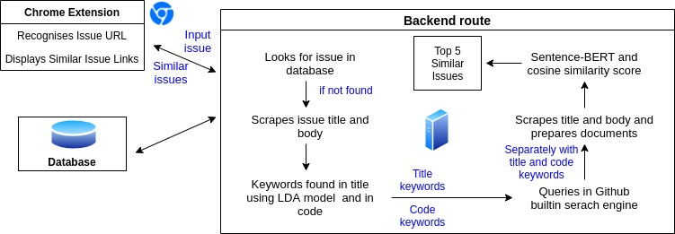
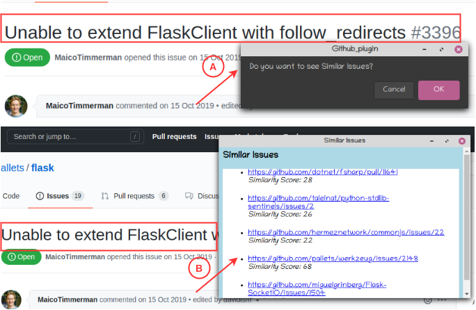

# IssueCatcher
  |  

## What is IssueCatcher
IssueCatcher is a chrome extension to help github users find similar issues and pull requests to the issue they want to solve/explore. There are millions of issues out there on Github, and it is most likely for one to encounter an issue that has already been reported and discussed in some other repository and hence can get solutions from these discussions that have happened under such similar issues. IssueCatcher provides list of top five similar issues and pull requests across the github to the input issue and fasten the development process.

## Features of IssueCatcher
- Identify the similar issues and pull requests across the github.
- After user clicks on an issue, confirmation pages comes that whether user wants to see similar issues or not and based on user input it followed by the pop-up displaying list of five most similar issues and pull requests.
- The issue's result which is already present in the database, gets updated by admin after every 15 days so that user gets an updated result.

## Working of IssueCatcher
The approach followed by IssueCatcher to detect similar issues and pull requests is summarised below.



- In current version, we have chrome extension as the client-side and server running at the backend.
- As soon as user clicks on an issue, issue url is sent to the backend as an input.
- Then, we see if input issue is available in the database or not, if issue is available in the database we directly fetch the result from the database and send to client-side to display.
- If issue is not available in the database, then we scrape input issue title and body and then using LDA model generates the important keywords from the title of the input issue.
- The top four generated important keyowrds from the previous step is used to make query to the github serach engine in order to get initial set of relevant issues.
- Then, we scrape list of issues along with the details (issue url, issue title, issue body) present in the first two pages of the result from the previous step.
- Now, pretrained Sentence BERT model takes input issue details and details of each of the issues we got from the previous step as input and generate similarity score.
- Based on similarity score, top five issues are send to the client-side as well as stored in the database.

## Snapshot of the UI


Snapshot of the UI of IssueCatcher. As soon as user clicks on an issue, the confirm message appears as shown by [A]. If user clicks on **OK**, pop-up appears as shown by [B], displaying the top five similar issues along with the Similarity Score.

## How to install IssueCatcher
- Clone this repository by typing following command in the Terminal
```
git clone https://github.com/shruti-shrz/Issue-Catcher.git
```
Or directly download this repository in your local system.
- Go to chrome://extensions/ in the chrome browser(you have now taken to the chrome extension page).
- Switch on the **Developer Mode**, by clicking on the button in the top right corner.
- Click on **Load unpacked**, now go to the *IssueCater* folder.
- Select the folder **plugin-client** inside the *IssueCater* folder and click open.
- Now, IssueCatcher plugin is installed and visible in the chrome extension page so switch ON the plugin incase its not by clicking on the button in the bottom right corner.

## How to Use IssueCatcher
- Navigate to the Github Issue page.
- Click on any issue (open or close) and wait for few seconds.
- A confirm pop-up will appear asking *Do you want to see Similar Issues?*, Click on Yes (in case popup doesn't come in few seconds refresh the page and wait).
- A prompt will come, displaying list of similar issues along with the similarity score.

## About the tool
* The extension, when switched ON, gets the URL the user is currently browsing, and if it is a Github Issue URL, it is passed on to the backend through a POST request asking for similar issues.
* In the backend, the title, body, labels and other useful details of the input issue are scraped with the help of **BeautifulSoup**. 
* The **LDA** model is used to extract keywords from the title of the input issue, and these are used to query for Github issues.
* The top 2 pages of issues are scraped, their details are obtained, and a similarity score is got w.r.t. the input issue for each of these top 2 pages issues using a **Sentence BERT** similarity model.
* Another thread in the backend simultaneously runs a search for issues having some of the same code the input issue has, and these are also given a similairty score.
* Finally top 5 issues' URLs are returned and displayed for user. 
* These issues and their similar issues are stored in a **MongoDB** Atlas database, so if some input issue is already there in the DB, the links are directly returned from DB.
* There is also an /admin route which takes GET requests and updates the issues in DB if the last update has been more than 15 days back.

## How to contribute to IssueCatcher
In case of any bug, feature improvisation or enhancement of the tool, please make a pull request or open an issue to discuss what you would like to change. In case of any query or suggestions please feel free to contact Shruti Priya (cs18b043@iitp.ac.in) or W Pranathi (cs18b045@iitp.ac.in) or Venigalla Akhila Sri Manasa (cs18m017@iitp.ac.in) or Sridhar Chimalakonda (ch@iittp.ac.in) of RISHA Lab, IIT Tirupati, India.

